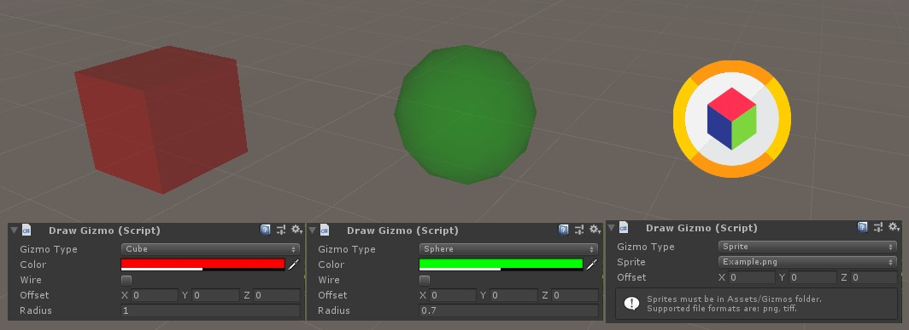

# DrawGizmo

A simple plugin to display a gizmo on any GameObject, using a cube, a sphere or a custom sprite.

Especially useful for spotting empty GameObjects in the Scene view.

## Getting Started

For a quick import into an existing project, just get the [UnityPackage](DrawGizmoPackage.unitypackage).

The DrawGizmo folder is an empty project with only the plugin imported and some examples! :)

## Screenshots

## Notes

* Last tested with [Unity 2018.3.1f1](https://unity3d.com/unity/whats-new/2018.3.1).

## Authors

* **[Arthur Cousseau](https://www.linkedin.com/in/arthurcousseau/)**

## License

This project is licensed under the MIT License - see the [LICENSE.md](LICENSE.md) file for details

## Notes

There isn't a "Radius" field for DrawGizmo when the selected Gizmo Type is "Sprite".
You can change the size of the sprite by clicking on the **Gizmos** button in the Scene view, and using the slider next to the **3D Icons** checkbox. More info at [Unity - Manual: Gizmos menu](https://docs.unity3d.com/Manual/GizmosMenu.html)
